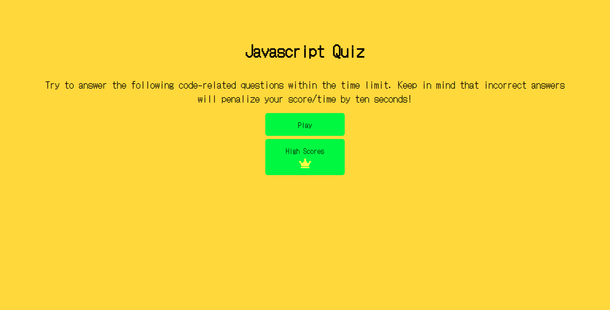
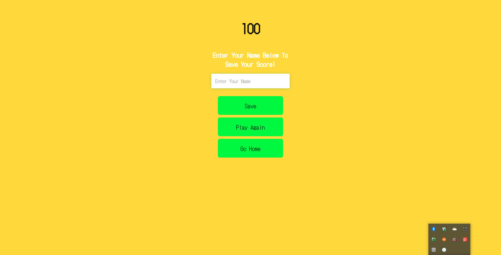

# Web APIs Challenge: Code Quiz

## PROJECT DESCRIPTION

---

- Build a timed coding quiz with multiple-choice questions.
- This app will run in the browser.
- The app will feature dynamically updated HTML and CSS powered by JavaScript.
- App will be responsive to user.
- Code JavaScript:
  - Work with DOM to store highscore information
  - Work with DOM to edit both HTML and CSS

---

### CODING LANGUAGES USED:

---

- HTML
- CSS
- JAVASCRIPT

#### SCREENSHOTS:

---

## 

## 

## 

## 

##### LINKS:

---

## [GitHub JavaScript Code Quiz Repo](https://github.com/MichealJWEllis/JavaScript_Quiz)

## [JavaScript Code Quiz Website](https://michealjwellis.github.io/JavaScript_Quiz/)

---

#### CONTRIBUTION:

Made with ❤️ by [Micheal Jw Ellis]
